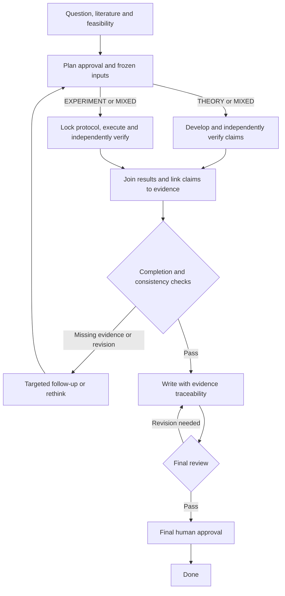

# Research Harness

A framework for running scientific workflows with structured evidence,
independent reviews, and recoverable Git history. Keep research data in a
separate workspace; install this repository as a reusable library.

## What it does

- Tracks questions, plans, claims, experiments, reviews, and decisions as validated artifacts.
- Lets agents propose changes; a deterministic controller validates and commits them.
- Pins reviews to evidence revisions and separates development from verification.
- Supports checkpoints, pause/resume, budget approval, and recovery after interruptions.

Two workflows are available: **full research** and **proposal review**.
The default runtime is **synthetic**, for testing the workflow without a model.
Real research needs a configured model host or a custom Python runtime adapter.

## Research workflow

### Full research



The plan selects **theory only**, **experiments only**, or **both**; a project
does not need every branch. The diagram summarizes the workflow: specific
review outcomes can return to the question, plan, claim, or affected work item.
Experiment protocols fix code/data identity, metrics, seeds, and interpretation
rules before execution. Failed, contradictory, and inconclusive results stay
in the record; they are not converted into support to advance the workflow.
Missing evidence or execution failures can leave a run blocked.

### Optional verification, including Lean

Choose `verification_profile` for each planned `ScientificClaim` output:

| Profile | Intended use | Required verification | Lean required? |
| --- | --- | --- | --- |
| `ADVERSARIAL` | Informal theoretical claims | Theory development and independent theory review | No |
| `CORE_FORMAL` | Claims requiring a formal proof | Theory review, Lean verification, axiom audit, and semantic alignment | Yes |
| `EMPIRICAL` | Hypotheses tested by experiments | Linked experiment design, execution, and independent verification; consistency checks before promotion | No |

Profiles belong to individual outputs, not a global `--lean` switch. For
example, a work package in a `ResearchPlan` can contain this output:

```yaml
planned_outputs:
  - local_id: main-result
    kind: ScientificClaim
    verification_profile: CORE_FORMAL
    description: Prove the main result under its stated assumptions.
    required: true
    depends_on_outputs: []
```

For `CORE_FORMAL`, the scheduled steps are **theory development → Lean
formalization → independent theory review → Lean verification with axiom
audit → semantic-alignment review**. Semantic alignment checks whether the
formal theorem matches the intended statement and assumptions. Once this
profile is selected, missing formal evidence cannot be waived to mark the
claim verified. Other outputs can use different profiles in the same plan.

Lean is a separate dependency: provide Lean/Lake and an appropriate mathlib
project. The [adapter](research_artifacts/tool_adapters.py) runs a build
(`lake build` by default), scans supplied sources for `sorry`, `sorryAx`, and
unapproved axiom declarations, reads reported axiom dependencies, and records
logs and source hashes. A stronger external checker can also be supplied.
**Current limitation:** the generic adapter does not itself verify the supplied
Lean/mathlib version labels or force an axiom-dependency report for every
target theorem. The execution setup must enforce those checks; a successful
build alone is not the complete formal-verification workflow.

### Proposal review

Choose `--mode proposal-review` to assess an existing proposal before doing
the research: structure the input, assess novelty, reconstruct its plan,
review correctness, handle decisions and authorized revisions, then obtain
final human approval. This path does not itself execute experiments or Lean
proofs. An approved proposal can optionally be converted into a **separate
full-research project**. See [usage](docs/usage.md) for commands.

## Quick start

Requires **Python 3.11+, Git, and a POSIX environment** with local Unix sockets
(such as Linux). From a cloned checkout:

```bash
python -m venv .venv
source .venv/bin/activate
python -m pip install .

# Use a new directory outside the source checkout.
export DEMO_WORKSPACE="$HOME/research-workspaces/harness-demo"
research --workspace "$DEMO_WORKSPACE" workspace-init
research --workspace "$DEMO_WORKSPACE" doctor
research --workspace "$DEMO_WORKSPACE" init demo \
  --objective "Test a traceable research workflow"
research --workspace "$DEMO_WORKSPACE" run demo \
  --runtime synthetic --budget-percent 10 --max-actions 2
research --workspace "$DEMO_WORKSPACE" status demo
```

This runs a small **simulation**, not scientific research. It may stop at an
approval gate. `workspace-init` creates an independent Git repository and
refuses nonempty directories. It does not configure a remote or push anything.

For real research, start with a fresh workspace and choose an executor below.
Do not reuse synthetic outputs as evidence. See the [usage guide](docs/usage.md)
for inputs, controls, and the Python API.

## Execution and runtime choices

| Executor | Purpose | Setup |
| --- | --- | --- |
| `synthetic` (CLI default) | Deterministic workflow tests, not scientific evidence | Python package only |
| `cordis` | Real model sessions through the optional host integration | [DeepSeek Harness integration](integrations/deepseek-harness/README.md), configured provider and running host |
| Custom Python adapter | Supply your own model-backed executor | Implement `SkillRuntime.execute(action, bundle)` through the [Python API](docs/usage.md#python-api) |

Models supply research content and structured judgments. The controller owns
state transitions: it validates proposed artifacts and reviews, evaluates
evidence gates, and commits accepted changes with a checkpoint. An adapter
does not bypass those checks. Runtime choice is separate from verification
profile; choosing a model host does not automatically enable Lean.

Human controls cover budget approval, pause/resume, cancellation, recovery,
and final approval. The Python controller can approve a plan with no blocking
reviews automatically; final research approval remains a human action.
Research files live under `WORKSPACE/projects/`; temporary execution files
live under `WORKSPACE/.harness/`.

## Documentation

- [Usage](docs/usage.md): workflows, CLI controls, Python API, configuration.
- [Architecture](docs/architecture.md): execution, authority, recovery, source map.
- [Contracts](docs/contracts.md): artifacts, verification, skill and runtime boundaries.
- [Contributing](CONTRIBUTING.md): development, evaluation, packaging checks.
- [Credits](docs/credits.md): design sources and integration baseline.

## Current limits

This is an early framework. Passing its gates checks evidence and workflow
rules; it does not establish that a scientific conclusion is true. The bundled
evaluations use deterministic fixtures, not live research benchmarks.
`--budget-percent` is an estimate, not a monetary spending cap. The runtime
uses local files and locks; distributed multi-writer execution is unsupported.

## License

[MIT](LICENSE). See [credits](docs/credits.md) for design sources.
