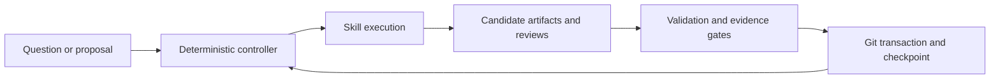

# Research Harness

A framework for running scientific workflows with structured evidence,
independent reviews, and recoverable Git history. Keep research data in a
separate workspace; install this repository as a reusable library.

## What it does

- Tracks questions, plans, claims, experiments, reviews, and decisions as validated artifacts.
- Lets agents propose changes; a deterministic controller validates and commits them.
- Pins reviews to evidence revisions and separates development from verification.
- Supports checkpoints, pause/resume, budget approval, and recovery after interruptions.

Two workflows are available: **full research** and **proposal review**.
The default runtime is **synthetic**, for testing the workflow without a model.
Real model execution requires the optional [DeepSeek Harness integration](integrations/deepseek-harness/README.md).

## Quick start

Requires **Python 3.11+, Git, and a POSIX environment** with local Unix sockets
(such as Linux). From a cloned checkout:

```bash
python -m venv .venv
source .venv/bin/activate
python -m pip install .

# Use a new directory outside the source checkout.
export DEMO_WORKSPACE="$HOME/research-workspaces/harness-demo"
research --workspace "$DEMO_WORKSPACE" workspace-init
research --workspace "$DEMO_WORKSPACE" doctor
research --workspace "$DEMO_WORKSPACE" init demo \
  --objective "Test a traceable research workflow"
research --workspace "$DEMO_WORKSPACE" run demo \
  --runtime synthetic --budget-percent 10 --max-actions 2
research --workspace "$DEMO_WORKSPACE" status demo
```

This runs a small **simulation**, not scientific research. It may stop at an
approval gate. `workspace-init` creates an independent Git repository and
refuses nonempty directories. It does not configure a remote or push anything.

For real research, follow the [model runtime setup](integrations/deepseek-harness/README.md)
and start with a fresh workspace. Do not reuse synthetic outputs as evidence.
See the [usage guide](docs/usage.md) for inputs, controls, and the Python API.

## How it works



Models supply research content and structured judgments. The controller owns
state transitions and promotion into accepted artifacts. Research files live
under `WORKSPACE/projects/`; temporary execution files live under `WORKSPACE/.harness/`.

## Documentation

- [Usage](docs/usage.md): workflows, CLI controls, Python API, configuration.
- [Architecture](docs/architecture.md): execution, authority, recovery, source map.
- [Contracts](docs/contracts.md): artifacts, verification, skill and runtime boundaries.
- [Contributing](CONTRIBUTING.md): development, evaluation, packaging checks.
- [Credits](docs/credits.md): design sources and integration baseline.

## Current limits

This is an early framework. Passing its gates checks evidence and workflow
rules; it does not establish that a scientific conclusion is true. The bundled
evaluations use deterministic fixtures, not live research benchmarks.
`--budget-percent` is an estimate, not a monetary spending cap. The runtime
uses local files and locks; distributed multi-writer execution is unsupported.

## License

[MIT](LICENSE). See [credits](docs/credits.md) for design sources.
