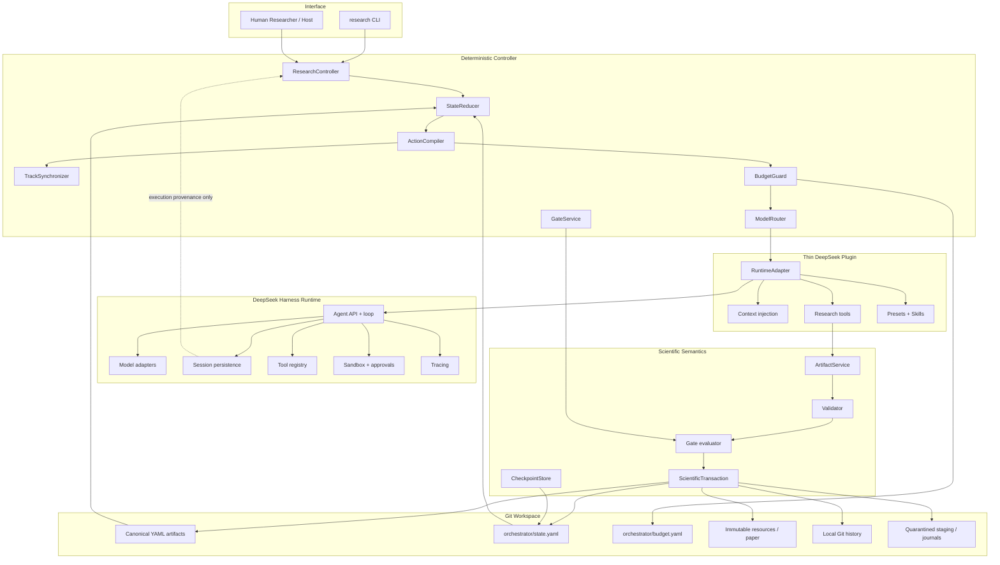
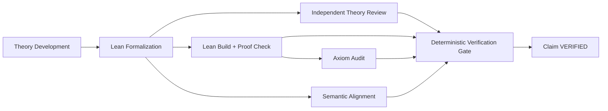

# Research Harness Architecture v0.1

## 1. Purpose

Research Harness is a controlled scientific workflow built on an existing
agent runtime. Its goal is not abstract agent autonomy. Its goal is to make
scientific work persistent, reviewable, reproducible, resumable, and resistant
to silent state corruption.

The architecture separates four concerns:

1. **Execution** — models, sessions, tools, sandboxes, and traces;
2. **Scientific state** — questions, evidence, plans, claims, experiments,
   reviews, and decisions;
3. **Control** — legal states, compiled actions, gates, retries, and recovery;
4. **Verification** — independent review, Lean, experiment integrity,
   traceability, and final validation.

DeepSeek Harness supplies execution. The Research Harness plugin supplies the
scientific semantics and deterministic control layer.

## 2. Layered architecture



### Authority boundary

| Decision | Sole authority |
|---|---|
| What model, tool, and session execute an action | DeepSeek Harness under controller policy |
| Which Skill runs next | ActionCompiler |
| Which global transition is legal | ResearchOrchestrator / StateReducer |
| Whether a candidate artifact is valid | ArtifactService + Validator |
| Whether a gate passes | GateService using structured pinned inputs |
| Whether a proposal becomes canonical | ScientificTransaction |
| Whether final submission is accepted | Human approval |

An LLM may create a proposal or Review. It cannot promote, transition, waive a
required gate, alter its permissions, or infer scientific truth from chat.

## 3. Sources of truth

| Information | Authoritative source |
|---|---|
| Prompts, model output, tool calls, failures, cancellation | DeepSeek session event log |
| Accepted scientific objects | Canonical YAML artifacts + Git |
| Workflow, branches, gates, retries, pending action | `orchestrator/state.yaml` |
| Budget, reservations, usage, pending increase | `orchestrator/budget.yaml` |
| Candidate changes | Quarantined action staging |
| Proofs, Lean reports, raw outputs, figures, manuscript | Checksummed path or URI |
| Historical scientific revisions | Git commit + artifact revision |

Session loss can reduce execution observability, but it cannot change or
reconstruct accepted scientific conclusions.

## 4. Runtime integration

The TypeScript Cordis plugin uses public DeepSeek Harness seams for:

- Agent creation/resume and the existing agent loop;
- model adapters and per-agent model selection;
- session persistence and token usage;
- tool registration and restriction;
- system-prompt context injection;
- skill registry and capability presets;
- sandbox policy, approval policy, and subagents;
- subprocess lifecycle for the versioned Python JSONL sidecar.

Python remains the single implementation of artifact, gate, lifecycle,
permission, and state-machine semantics. TypeScript translates a compiled
action into one isolated runtime session; it does not duplicate the reducer.

## 5. Action compilation and context

`ActionCompiler` maps persisted state and policy to one action containing:

- Skill and capability preset;
- target artifact or planned output;
- revision-pinned input references;
- permitted artifact kinds, operations, and field diffs;
- allowed tools and working directory;
- completion and failure contract;
- scientific risk, difficulty, and uncertainty for model routing.

`ResearchContextBuilder` selects an explicit allowlist plus a bounded dependency
closure. It never loads the full repository or conversation. Every bundle pins
the input Git commit, artifact revisions, and a content hash. A pending action
resumes with its persisted bundle even if an operational budget commit has
advanced Git HEAD.

## 6. Artifact and transaction model

Agents receive only these scientific-state operations:

```text
read / query / resolve / validate / propose / action_submit
```

Canonical promotion is host-only:

```text
proposal
→ quarantined staging
→ multi-artifact overlay validation
→ schema and layout validation
→ reference and Claim-DAG validation
→ lifecycle validation
→ Skill × Operation × Artifact × Field-Diff validation
→ base revision and checkpoint conflict validation
→ journaled scientific transaction
→ canonical files + checkpoint
→ explicit-path local Git commit
```

Create operations require an absent ID and path. Revisions require an exact
base revision. Duplicate promotion is idempotent. Unrelated dirty or staged user
files are not included in a scientific commit.

## 7. Workflow and synchronization

```text
Discovery / Feasibility
→ Planning + Track Routing
→ Theory and/or Experiment
→ Join + Synthesis
→ Completion Check
→ Consistency / Targeted Follow-up
→ Writing + Final Review
→ Human Final Approval
→ Done
```

MIXED projects freeze one planning snapshot. Theory and experiment may run
sequentially in v0.1, but preserve logical isolation:

- both read the same frozen Plan boundary;
- each owns separate artifacts and action sessions;
- neither reads the sibling's live intermediate conversation;
- completed work is not replayed when the sibling retries;
- synchronization happens only at Join;
- Synthesis records support, contradiction, and uncertainty explicitly.

Gate failures route to the minimum affected scope. `INCOMPLETE` creates targeted
follow-up. A failed proof does not automatically kill the Plan, and retry
exhaustion does not silently escalate rethink scope.

## 8. Verification architecture

### Core formal theory



All Reviews pin the same pre-verification Claim revision. Final promotion may
change verification status and references, but never the theorem statement or
assumptions. A substantive change creates a replacement Claim and restarts
verification.

### Experiment integrity

```text
design without final result visibility
→ protocol lock
→ stable run IDs
→ raw-output-preserving execution
→ independent metric/statistical/reproducibility audit
→ SUPPORTED / CONTRADICTED / INCONCLUSIVE
→ synthesis
```

Contradiction is a scientific outcome, not a runtime failure. Protocol changes
after `READY` require redesign rather than an executor edit.

### Manuscript traceability

The manuscript is a deliverable, not a new source of scientific facts.
`paper/traceability.yaml` maps major statements and resources to accepted
Claims, Experiments, LiteratureEvidence, and immutable resources. Final review
blocks overclaiming, stale references, and representation mismatch.

## 9. Cost and model policy

The model router uses configurable tier aliases. Each Skill has a quality floor
and default reasoning effort. Risk, difficulty, uncertainty, and prior failure
may escalate a tier; budget may not lower it.

The budget ledger persists:

- approved, used, reserved, and estimated remaining percentage;
- protected verification reserve;
- action, Skill, model, and reasoning entries;
- provider token usage when available;
- exact minimum and recommended increase requests.

Initial and increased authority is recorded as an accepted Decision Artifact.
When actual Codex allowance is not observable, estimates remain relative and
the system does not invent absolute credits.

## 10. Failure and recovery

The recovery rule is: use the last valid artifact, Git, and checkpoint state;
fail closed when that state cannot be explained.

| Failure | Recovery behavior |
|---|---|
| Model/tool timeout | Retry within policy; preserve pending action and trace |
| Revision conflict | Rebuild context; never overwrite the newer revision |
| Agent/sidecar crash | Resume persisted action/session and inspect journals |
| Interrupted experiment | Reuse stable run ID and existing raw outputs |
| Partial promotion | Finish known commit or restore journal backups |
| Corrupt checkpoint | Recover last Git-valid checkpoint and enter `BLOCKED` |
| Remote push failure | Keep valid local scientific commit; retry replication |
| Budget exhaustion | Enter `WAITING_HUMAN:BUDGET`; preserve scientific state |
| User pause | Preserve resume state and pending work |
| User cancel | Record permanent cancellation; direct resume is forbidden |

Leaving `BLOCKED` requires an explicit recovery Decision. `CANCEL` is not an
alias for `PAUSE`.

## 11. Implementation map

| Component | Location |
|---|---|
| Artifact schemas | `schemas/v0.1.2/` |
| Checkpoint and gate schemas | `schemas/orchestrator/v0.1/` |
| Runtime contracts | `schemas/runtime/v0.1/` |
| Artifact validation | `research_artifacts/workspace.py` |
| Proposal service | `research_artifacts/artifact_service.py` |
| State reducer and gates | `research_artifacts/orchestrator.py` |
| Action compilation | `research_artifacts/action_compiler.py` |
| Context construction | `research_artifacts/context_builder.py` |
| Scientific transactions | `research_artifacts/transactions.py` |
| Cost control and model routing | `research_artifacts/cost_control.py` |
| Lean and experiment adapters | `research_artifacts/tool_adapters.py` |
| Python controller and CLI | `research_artifacts/mvp.py`, `mvp_cli.py` |
| Sidecar protocol | `research_artifacts/sidecar.py` |
| DeepSeek integration | `integrations/deepseek-harness/src/` |
| Scientific Skills | `integrations/deepseek-harness/skills/` |
| Scientific evaluation | `research_evals/`, `evals/` |
| Golden pilots | `research_artifacts/golden_pilots.py`, `projects/proj-golden-*` |

## 12. v0.1 boundary

v0.1 uses one canonical Git workspace and one controller writer per project. It
does not include a database, vector store, distributed transactions, parallel
Git writers, tree search, multi-model voting, campaign orchestration,
cross-project memory, or a graphical UI.

Future scaling should preserve the existing authority boundaries: runtime
events are execution truth, artifacts are scientific truth, gates are
deterministic, negative evidence is durable, and no model controls the global
state machine.
