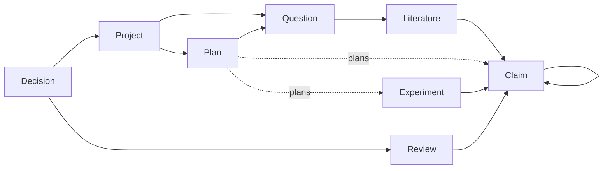

# Artifact Schema v0.1.1

## Architecture

The Artifact Layer is a filesystem contract between research agents. Existing
agent runtimes continue to own sessions, context assembly, tools, permissions,
loops, skills, and scheduling. This layer owns only durable scientific state.

Every artifact has a common envelope with a schema version, kind, immutable ID,
project ID, lifecycle status, revision, timestamps, provenance, and tags.
Project artifacts omit `project_id` because their `id` is the project boundary.

| Kind | Durable responsibility |
|---|---|
| Project | Objective, active stage, operational status, and deliverables |
| ResearchQuestion | Problem, gap, hypotheses, contributions, and risks |
| ResearchPlan | Work packages, dependencies, milestones, planned outputs, and materialization mappings |
| LiteratureEvidence | Paper analysis, relation, differences, novelty impact, and confidence |
| ScientificClaim | Statement, assumptions, dependencies, evidence, and verification |
| Experiment | Reproducible protocol, exact code/config/data, runs, and result |
| Review | Exact-revision feedback, issue severity, recommendation, and resolution |
| Decision | Long-term rationale, alternatives, evidence, impact, and supersession |

The JSON Schemas in `schemas/v0.1.1/` are authoritative for fields and enums.
Historical complete examples are test-only fixtures under
`tests/fixtures/projects/proj-demo/`; the production `projects/` directory is
kept free of demos.

## Dependency rules



- References resolve by ID and declared kind, never by artifact file path.
- v0.1.1 references remain within one project.
- Claim dependencies, plan work-package dependencies, and planned-output
  dependencies must be DAGs.
- A ResearchPlan names future outputs with Plan-local stable IDs. It references
  real artifacts only in `materialized_outputs`, after execution has begun.
- A DONE work package must materialize all required outputs, and those outputs
  must have a successful kind-specific status.
- A pinned revision may be older than the current target but never newer.
- Large resources use a URI and, where possible, a SHA-256 digest.

## Lifecycle semantics

The principal Claim path is:

```text
IDEA -> FORMALIZED -> SUPPORTED -> VERIFIED -> IN_PAPER
```

`FAILED` means an attempt did not establish the current formulation.
`INVALIDATED` means contradictory evidence, a counterexample, or a broken
assumption makes it unusable. Both are terminal for that formulation; a new
claim must use a new ID and may point back through `replacement_ref`.

The Project stage path is:

```text
QUESTION -> LITERATURE -> PLANNING -> THEORY_EXPERIMENT -> REVIEW -> WRITING -> COMPLETE
```

Review and Writing may route back to question, planning, or theory/experiment
when the orchestrator records an explicit rethink verdict. Stage validation is
structural, not a claim that the science is correct.

## ResearchPlan output contract

Planning does not create placeholder Claims or Experiments:

```yaml
planned_outputs:
  - local_id: theory-main-bound
    kind: ScientificClaim
    description: Establish the main convergence bound.
    required: true
    depends_on_outputs: []
materialized_outputs: []
```

At the execution boundary, a real artifact is created and the same Plan-local
ID is bound to it. `local_id` values are unique across the Plan. Experiment
outputs must depend on at least one planned ScientificClaim output, and READY
or later Experiments pin the exact Claim revision they test.

## Update protocol

1. Read artifacts by ID and record their current revisions.
2. Produce a candidate YAML update.
3. Validate its schema and the resulting complete workspace.
4. Require `expected_revision` and increment the artifact revision exactly once.
5. Atomically replace the file.
6. Commit logically inseparable artifact changes together in Git.

Accepted Decisions should not be substantively rewritten. A later Decision
supersedes or reverses the earlier record. Reviews likewise remain tied to the
exact target revision they assessed.
