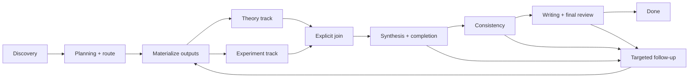

# Research Orchestrator / State Machine v0.1

## Boundary

The orchestrator is a deterministic controller. Existing runtimes continue to
own sessions, context assembly, agent loops, tool execution, permissions,
skills/plugins, and traces. The controller accepts typed events, validates
their artifact snapshot, persists a checkpoint, and returns runtime commands.
It never infers a transition from free-form chat or review prose.

## States and events

The normative state and gate enums live in
`schemas/orchestrator/v0.1/state.schema.json` and `gate.schema.json`.
`StateReducer.reduce(checkpoint, event)` is a pure function. Normal progression
uses these events:

| Phase | Events |
|---|---|
| Discovery | `QUESTION_ACTIVATED`, `LITERATURE_READY`, `GATE_RECORDED` |
| Planning | `PLAN_VALIDATED`, `PLAN_APPROVED`, `PLAN_REVISION_REQUIRED`, `ROUTE_SELECTED` |
| Execution | `OUTPUTS_MATERIALIZED`, `SKILL_COMPLETED`, `TRACK_ADVANCED`, `TRACKS_JOINED`, `JOIN_COMPLETED` |
| Synthesis | `SYNTHESIS_COMPLETED`, `GATE_RECORDED` |
| Follow-up | `FOLLOWUP_PLANNED`, `CLAIM_REPLACED` |
| Writing | `WRITING_COMPLETED`, `GATE_RECORDED`, `REVISION_COMPLETED`, `FINAL_APPROVED`, `FINAL_REVISION_REQUIRED` |
| Interrupts | `USER_PAUSE`, `RESUME`, `USER_CANCEL`, `ACTION_FAILED`, `UNBLOCK` |

`RETHINK_CLAIM`, `RETHINK_PLAN`, and `RETHINK_QUESTION` route to different
levels and never auto-escalate. `INCOMPLETE` enters targeted follow-up.

## Routing and synchronization

The router derives THEORY, EXPERIMENT, or MIXED from required outputs in the
approved Plan. `EXECUTION_MATERIALIZE` binds Plan-local IDs to real artifacts.
It also initializes checkpoint `skill_progress` for every materialized
ScientificClaim or Experiment. `SKILL_COMPLETED` advances only that local
queue and does not change the global state; `TRACK_ADVANCED` is rejected until
the Skills required by the current branch phase are complete.
For MIXED work, both branch states advance independently from the same frozen
Git/artifact snapshot. The join rejects progress until every selected branch
is `COMPLETED` or explicitly `WAIVED`.

Experiments pin `hypothesis.claim_ref.revision`. A Consistency PASS is rejected
when a completed experiment targets an older revision than the current Claim;
the reviewer must confirm applicability or request targeted follow-up.

## Checkpoint and recovery

Each project stores `orchestrator/state.yaml`. It includes the run ID, state,
route, active Plan revision, frozen snapshot, branch states, gate history,
retry counters, action IDs, and interruption metadata. Writes are atomic and
require `expected_seq`.

`begin_action` persists a stable action ID before runtime dispatch. On resume,
the runtime checks that ID plus Experiment run IDs and immutable output URIs;
it does not replay chat. Artifact revision drift is rejected and requires a
fresh bounded context.

`PAUSED_BY_USER` is resumable and maps to `Project.PAUSED`.
`CANCELLED_BY_USER` is terminal and requests an accepted cancellation Decision
plus `Project.ARCHIVED`. `BLOCKED` records a recovery condition and maps to
`Project.BLOCKED`; it is not a user stop.

## Runtime commands

Reducer commands are deliberately small: `ENTER_STATE`, `RETRY_ACTION`,
Project status/stage updates, and cancellation Decision creation. A runtime
adapter executes these through existing tools and agent loops, validates the
resulting artifacts, and commits coherent artifact plus checkpoint changes to
Git. The controller itself performs no Git push and no scientific generation.
