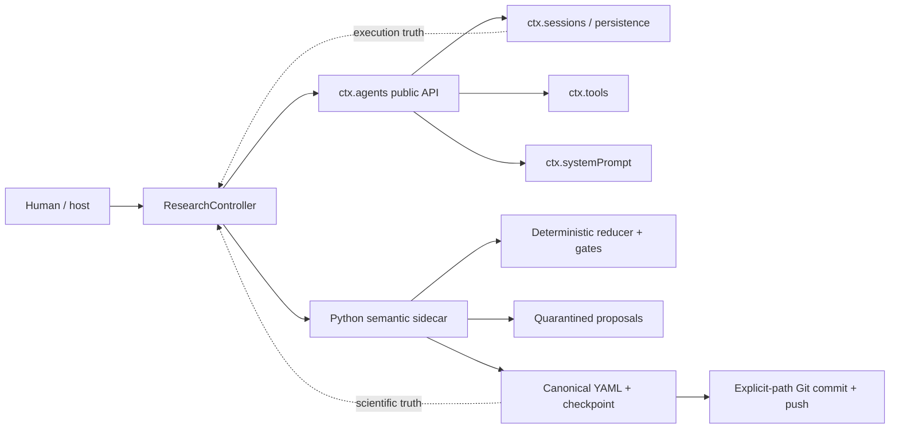

# Research Harness Runtime Integration v0.1

Compatibility baseline: DeepSeek Harness `0.1.0-rc.8`, commit
`141eb6fef83422698aef7a981029e843e8161534`. The integration is a Cordis plugin
plus a Python stdin/stdout sidecar. It does not fork Harness core and never
imports `@deepseek-ai/dsh-agent-loop`.

## Architecture and ownership



DeepSeek sessions own prompts, model output, tool calls, errors, cancellation,
and execution provenance. Canonical YAML, Git, and
`projects/<project>/orchestrator/state.yaml` own accepted scientific and
workflow state. Neither the controller nor recovery code derives research facts
from conversation text.

## Official Harness seams reused

- Cordis `name`, `inject`, `apply`, services, scoped effects and cleanup:
  [plugin framework](https://github.com/deepseek-ai/deepseek-harness/blob/141eb6fef83422698aef7a981029e843e8161534/docs/user/develop/framework/index.md).
- `ctx.agents.create/resume`, `Agent.followup/cancel/whenIdle`, and owned
  `AgentHandle.dispose`:
  [agent registry](https://github.com/deepseek-ai/deepseek-harness/blob/141eb6fef83422698aef7a981029e843e8161534/packages/core/agent/src/index.ts) and
  [runtime types](https://github.com/deepseek-ai/deepseek-harness/blob/141eb6fef83422698aef7a981029e843e8161534/packages/core/agent/src/runtime-types.ts).
- `ctx.sessions.flush` and existing persistence listing/resume:
  [session store](https://github.com/deepseek-ai/deepseek-harness/blob/141eb6fef83422698aef7a981029e843e8161534/packages/core/session/src/index.ts) and
  [session persistence](https://github.com/deepseek-ai/deepseek-harness/blob/141eb6fef83422698aef7a981029e843e8161534/packages/session/session-persistence/src/index.ts).
- `defineTool` and agent-scoped `ctx.tools.register`:
  [tool runtime](https://github.com/deepseek-ai/deepseek-harness/blob/141eb6fef83422698aef7a981029e843e8161534/packages/core/tools/src/index.ts).
- Durable runtime context and authority-boundary sections:
  [system prompt registry](https://github.com/deepseek-ai/deepseek-harness/blob/141eb6fef83422698aef7a981029e843e8161534/packages/core/system-prompt/src/index.ts).
- Preset joining during unpublished agent setup and runtime skill registration:
  [agent presets](https://github.com/deepseek-ai/deepseek-harness/blob/141eb6fef83422698aef7a981029e843e8161534/packages/preset/agent-presets/src/index.ts) and
  [skill registry](https://github.com/deepseek-ai/deepseek-harness/blob/141eb6fef83422698aef7a981029e843e8161534/packages/skill/skill/src/index.ts).
- Per-session sandbox mode and approval policy:
  [sandbox policy](https://github.com/deepseek-ai/deepseek-harness/blob/141eb6fef83422698aef7a981029e843e8161534/packages/sandbox/sandbox-policy/src/index.ts) and
  [user approval](https://github.com/deepseek-ai/deepseek-harness/blob/141eb6fef83422698aef7a981029e843e8161534/packages/interaction/user-approval/src/index.ts).
- Managed, pipe-mode sidecar lifecycle:
  [subprocess service](https://github.com/deepseek-ai/deepseek-harness/blob/141eb6fef83422698aef7a981029e843e8161534/packages/subprocess/subprocess/src/index.ts).

## State action lifecycle

1. `ResearchController` reads the versioned checkpoint and pushes any pending
   local scientific commit before dispatching more work.
2. The deterministic controller handles routing and join states itself. Human
approval states stop with `HUMAN_REQUIRED`.
3. `begin_action` records a stable action ID, input Git commit, and checkpoint
   before model dispatch.
4. `ResearchContextBuilder` selects an explicit state policy plus a bounded
   dependency closure, pins revisions and hashes, validates the runtime schema,
   and persists an immutable ContextBundle.
5. `DeepSeekRuntimeAdapter` derives a stable SessionId, creates or resumes the
   action session, mounts the controller-selected preset and role skill,
   injects the ContextBundle, fixes approval to `never`, and selects a sandbox
   rooted at the action cwd.
6. The handler can read/query/resolve, validate, stage CREATE/REVISE proposals,
   and submit a structured result. It cannot promote a proposal.
7. The Python overlay validator checks schemas, references, DAGs, lifecycle,
   base revisions, bundle ownership, and exact output allowlists.
8. Gate assessments are validated deterministically. The controller maps the
   current state and structured submission to one enumerated reducer event.
9. `ScientificTransaction` locks the project, rechecks Git/checkpoint/revisions,
   journals backups, replaces only declared files, applies Project commands and
   Decisions, validates the complete workspace, and commits explicit paths.
10. Local commit is the scientific commit point. Push failure keeps it intact,
    prevents further dispatch, consumes the `remote_push` retry counter, and
   eventually produces a distinct `BLOCKED` checkpoint.

Writer actions are the one resource-only transaction: they may submit zero
artifact proposals only when `paper/traceability.yaml` passes the runtime
schema. The transaction discovers and commits explicit changed files under the
project `paper/` directory together with the checkpoint; it rejects every path
outside that scope.

`EXECUTION_MATERIALIZE` is controller-only. A host transaction creates
schema-valid IDEA Claims and DRAFT Experiments from stable planned-output IDs,
updates Plan mappings, initializes `skill_progress`, checkpoints, journals,
commits, and pushes atomically. Scientific content is then filled by the
assigned development/design Skills; no placeholder artifact exists during
planning.

## Context and staging contracts

Runtime JSON Schemas live in `schemas/runtime/v0.1/`. Context defaults are 64
artifacts and 512 KiB. Exceeding either limit fails closed; input is never
silently truncated. Resource references contribute immutable metadata by
default rather than loading large bytes.

Staging lives under
`.harness/research/staging/<project>/<action>/` and is excluded from canonical
artifact discovery. A proposal binds the action, session, bundle hash,
operation, candidate, base revision, and proposal hash. Empty output allowlists
mean no authority, not unrestricted authority. The transaction-result record
makes repeated promotion of the same action idempotent.

## Presets and Skills

The eight capability presets are `research-producer`, `research-reviewer`,
`research-theory`, `research-formal`, `research-formal-reviewer`,
`research-experiment`, `research-experiment-reviewer`, and `research-writer`.
Write-capable sessions receive filesystem/shell capabilities only inside their
action or paper cwd; producer and ordinary reviewer sessions are read-only.
`tools.restrict()` is not treated as an authority boundary. Canonical promotion
is absent from every model tool registry.

Nineteen Skills split theory development from three independent verification
roles, and split experiment design, execution, and verification into separate
sessions; the two proposal-only Skills independently review correctness and
apply authorized revisions. `skill_progress` persists the required queue for each planned output;
`SKILL_COMPLETED` does not change the global state, and a branch advances only
after its required Skills pass. The controller selects the role; a model cannot
self-route.

Context output authority is enforced as Skill + operation + artifact kind +
field diff. Writer contexts have no scientific artifact output authority,
reviewers can only create Review artifacts, execution can only append runs and
status, and formalization can only add Claim verification resources.

## Resume, cancellation, and recovery

Session IDs are hashes of project, run, action, role, and attempt. Resume checks
existing session persistence, reconstructs the identical ContextBundle hash,
and never replays a project-wide chat. Revision drift invalidates proposals.
Stable experiment run IDs remain artifact-level deduplication keys.

`PAUSED_BY_USER`, `CANCELLED_BY_USER`, and `BLOCKED` remain distinct. Pause
cancels a live agent and preserves the pending action. Cancellation archives
the Project and creates an accepted Decision. Blocked records an objective
recovery condition. PREPARED promotion journals are finished or rolled back by
`transaction.recover`; a committed Git action is never rolled back merely
because journal finalization failed.

## Loading

The package ships `cordis.patch.yml`, which adds the plugin row when installed
with `dsh plugin add`. `scripts/install_dsh_plugin.sh PROFILE` builds the
TypeScript package, registers the local package in that profile and copies only
missing `research-*` presets into the user's preset root. Existing presets are
left untouched. Manual composition can instead configure
`integrations/deepseek-harness/presets` as a system root and load this package
as a normal Cordis row:

```yaml
- id: research-runtime
  name: '@research-harness/deepseek-integration'
  config:
    workspace: /absolute/path/to/research-workspace
    python: python3
    push: true
    pushAttempts: 3
    operatorSocket: .harness/research/cordis.sock
```

The host composition must already provide the standard Agent, Session,
Persistence, Tool, Prompt, Skill, Preset, Sandbox, Approval, Subprocess, model,
filesystem, and shell services. This plugin deliberately does not construct a
second runtime stack.

`operatorSocket` enables the host-only JSONL operator bridge. It accepts
init/status/run and human-control commands, plus proposal decisions, approval,
and conversion. The POSIX socket must resolve inside `workspace`, is created
with mode `0600`, rejects requests over 1 MiB, and refuses to overwrite a stale
filesystem entry. It is not exposed as a model tool. The supported client is
`scripts/research-cordis`; `RESEARCH_HARNESS_SOCKET` supplies its default path.

Proposal initialization sends `workflowMode: PROPOSAL_REVIEW` and absolute
proposal/rubric paths through the same controller and sidecar. The controller
handles proposal gate evaluation and decision-template creation itself; model
sessions can submit structured reviews and revisions but cannot approve,
promote, waive blockers, or create derived projects.

## Compatibility and limits

All DeepSeek dependencies are pinned to rc.8 and imported from package roots.
The TypeScript/Python seam is versioned JSONL with structured errors. There is
one sidecar per workspace, one controller writer per project, and only a local
file lock—not a distributed transaction. No database, vector store, new agent
loop, model protocol, tool protocol, tree search, campaign mode, or
cross-project memory is introduced.

Human hosts use the host-only `ctx.research.recordEvent(...)` method to submit
an enumerated approval or unblock event after the corresponding canonical
artifact revision has been accepted. It still passes through the Python
validator, scientific control transaction, explicit Git commit, and push; it
is never registered as a model tool.
